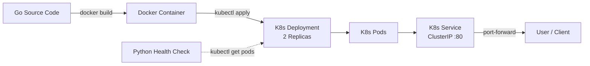

# NVIDIA DGX Cloud Kubernetes Runtime Demo

<p align="center">
  
  
  
  
  
</p>

## Overview

A production-grade demonstration of running containerized workloads on a Kubernetes runtime — built to showcase the foundational skills required for managing GPU-accelerated infrastructure on **NVIDIA DGX Cloud**. This project packages a Go microservice into a minimal container, deploys it declaratively onto a local Kubernetes cluster via manifests, and validates cluster state with a Python automation script.

---

## Architecture



---

## Kubernetes Concepts Demonstrated

| Concept | What it does in this project |
|---|---|
| **Pods** | Each replica runs inside its own pod — the smallest deployable unit in K8s. Our deployment manages 2 of them. |
| **Deployments** | Declares the desired state (2 replicas, container image, resource limits). The Kubernetes controller reconciles the actual state to match. |
| **Services** | Provides a stable network identity (`ClusterIP`) that load-balances traffic across the 2 pods, decoupling the backend from consumers. |
| **Namespaces** | Isolates our demo resources under `nvidia-runtime-demo`, preventing collisions with other workloads in the cluster. |
| **Health Probes** | The deployment includes `livenessProbe` and `readinessProbe` — patterns essential for GPU workloads where node health directly impacts training jobs. |

---

## Prerequisites

- [Go](https://go.dev/dl/) 1.22+
- [Docker](https://docs.docker.com/get-docker/) 24+
- [Kind](https://kind.sigs.k8s.io/) (or Minikube)
- [kubectl](https://kubernetes.io/docs/tasks/tools/) 1.29+
- [Python](https://www.python.org/downloads/) 3.10+

---

## Quickstart

```bash
# 1. Clone the repository
git clone https://github.com/nissandutta/nvidia-dgx-cloud-k8s-demo.git
cd nvidia-dgx-cloud-k8s-demo

# 2. Full demo: cluster → build → deploy → verify
make all

# Or step by step:
make kind-up        # Spin up a local K8s cluster
make build          # Build the Docker image
make deploy         # Apply all K8s manifests
make verify         # Run the Python health check

# 3. Test the app locally
make port-forward   # Forward service to localhost:8080
curl http://localhost:8080/
# → "Hello from NVIDIA DGX Cloud Runtime Pod!"
```

---

## Makefile Reference

| Target | Description |
|---|---|
| `make help` | List all available targets |
| `make build` | Build the Go app into a minimal Docker image |
| `make kind-up` | Create a local Kind cluster |
| `make deploy` | Apply namespace, deployment, and service manifests |
| `make verify` | Run the Python health check to validate pod state |
| `make port-forward` | Expose the service on `localhost:8080` |
| `make clean` | Tear down all deployed resources |

---

## Repository Structure

```
nvidia-dgx-cloud-k8s-demo/
├── app/
│   ├── go.mod                     # Go module definition
│   └── main.go                    # HTTP server (port from PORT env var)
├── automation/
│   └── health_check.py            # Python script: kubectl → JSON parse → report
├── k8s/
│   ├── namespace.yaml             # Creates nvidia-runtime-demo namespace
│   ├── deployment.yaml            # 2 replicas, resource limits, health probes
│   └── service.yaml               # ClusterIP on port 80 → target port 8080
├── Dockerfile                     # Multi-stage: build in golang, run on alpine
├── Makefile                       # DevEx automation (build, deploy, verify, clean)
└── README.md                      # You are here
```

---

## Why This Matters for DGX Cloud

NVIDIA DGX Cloud runs large-scale GPU clusters orchestrated by Kubernetes. The skills demonstrated in this project map directly to the DGX Cloud runtime ecosystem:

- **Containerization** — Every DGX workload is containerized. This project's multi-stage Dockerfile mirrors the image-building patterns used in production GPU pipelines.
- **Declarative Infrastructure** — Kubernetes manifests (YAML) are the universal language for describing DGX Cloud deployments, from single-node inference to multi-node distributed training.
- **Automation** — Python scripting against the Kubernetes API enables the kind of cluster-state validation and health monitoring that keeps DGX Cloud customer workloads running reliably.
- **DevEx** — A clean Makefile interface (build → deploy → verify → clean) reflects the operator experience that DGX Cloud engineers build for internal teams and customers.

---

## License

MIT © Nissand Dutta
