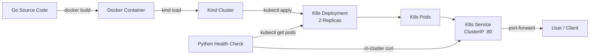

# NVIDIA DGX Cloud Kubernetes Runtime Demo

<p align="center">
  
  
  
  
  
</p>

## Problem

NVIDIA DGX Cloud orchestrates GPU workloads on Kubernetes at scale. Platform engineers need reproducible deploy pipelines, health validation, and GPU scheduling patterns — not just YAML snippets.

## What I Built

- **Go microservice** with `/` and `/health` endpoints, packaged in a multi-stage Alpine container
- **Declarative K8s stack** — Namespace, 2-replica Deployment (probes + resource limits), ClusterIP Service
- **Makefile workflow** — `make all` runs Kind → build → image load → deploy → verify in one command
- **Python automation** — pod phase report plus in-cluster HTTP check against the service
- **GPU extension** — optional manifest with `nvidia.com/gpu` requests and production notes ([docs/gpu-workloads.md](docs/gpu-workloads.md))

## Proof

| Artifact | Link |
|---|---|
| Demo video | `[YOUR_DEMO_VIDEO_URL]` — see [docs/demo-recording.md](docs/demo-recording.md) for script |
| CI | Go build/vet + manifest dry-run validation on every push |
| Outreach templates | [docs/outreach-templates.md](docs/outreach-templates.md) |
| Resume / LinkedIn copy | [docs/profile-materials.md](docs/profile-materials.md) |
| Next-cycle apply checklist | [docs/application-checklist.md](docs/application-checklist.md) |

### Demo Verified (expected flow)

```bash
make all
# → Kind cluster created, image built & loaded, manifests applied, pods ready, HTTP /health OK

make port-forward   # separate terminal
curl http://localhost:8080/
# → Hello from NVIDIA DGX Cloud Runtime Pod!

curl http://localhost:8080/health
# → OK
```

Sample `make verify` output:

```
────────────────────────────────────────────────────────────
  NVIDIA DGX Cloud — Pod Health Report
  Namespace: nvidia-runtime-demo
────────────────────────────────────────────────────────────
  🎉 All 2 pods are healthy and running!

  HTTP HEALTH
  ✅ GET http://nvidia-demo-svc/health → OK
────────────────────────────────────────────────────────────
```

### Honest Limits

- Runs on **local Kind without GPUs** — the optional GPU deployment stays `Pending` until scheduled on a GPU node (by design)
- Focus is **platform/runtime automation**, not CUDA kernel development
- See [docs/gpu-workloads.md](docs/gpu-workloads.md) for production GPU cluster requirements

---

## Architecture



---

## Prerequisites

- [Go](https://go.dev/dl/) 1.22+
- [Docker](https://docs.docker.com/get-docker/) 24+
- [Kind](https://kind.sigs.k8s.io/)
- [kubectl](https://kubernetes.io/docs/tasks/tools/) 1.29+
- [Python](https://www.python.org/downloads/) 3.10+

---

## Quickstart

```bash
git clone https://github.com/nissandutta31-maker/Kubernetes.git
cd Kubernetes

# Full demo: cluster → build → load image → deploy → verify
make all

# Test locally
make port-forward   # separate terminal
curl http://localhost:8080/
curl http://localhost:8080/health
```

Or step by step:

```bash
make kind-up
make build
make load-image
make deploy
make verify
```

Optional GPU manifest (Pending on Kind without GPUs):

```bash
kubectl apply -f k8s/gpu-deployment.yaml
kubectl get pods -n nvidia-runtime-demo -l app=nvidia-gpu-demo
```

---

## Makefile Reference

| Target | Description |
|---|---|
| `make help` | List all available targets |
| `make build` | Build the Go app into a minimal Docker image |
| `make load-image` | Load the local image into the Kind cluster |
| `make kind-up` | Create a local Kind cluster |
| `make deploy` | Apply namespace, deployment, and service manifests |
| `make verify` | Run Python health check (pods + HTTP `/health`) |
| `make validate-manifests` | Dry-run validate all K8s YAML |
| `make port-forward` | Expose the service on `localhost:8080` |
| `make clean` | Remove all deployed resources |
| `make all` | Full demo pipeline |

---

## Repository Structure

```
├── app/
│   ├── go.mod
│   └── main.go
├── automation/
│   └── health_check.py
├── docs/
│   ├── application-checklist.md
│   ├── demo-recording.md
│   ├── gpu-workloads.md
│   ├── outreach-templates.md
│   └── profile-materials.md
├── k8s/
│   ├── namespace.yaml
│   ├── deployment.yaml
│   ├── service.yaml
│   └── gpu-deployment.yaml
├── Dockerfile
├── Makefile
└── README.md
```

---

## Why This Matters for DGX Cloud

NVIDIA DGX Cloud runs large-scale GPU clusters orchestrated by Kubernetes. This project demonstrates the operational patterns those teams use daily:

- **Containerization** — multi-stage Docker build, non-root runtime user
- **Declarative infrastructure** — version-controlled manifests with probes and resource limits
- **Automation** — scripted cluster validation including HTTP health through the service
- **GPU scheduling** — documented manifest for `nvidia.com/gpu`, node selectors, and tolerations

---

## License

MIT © Nissand Dutta
